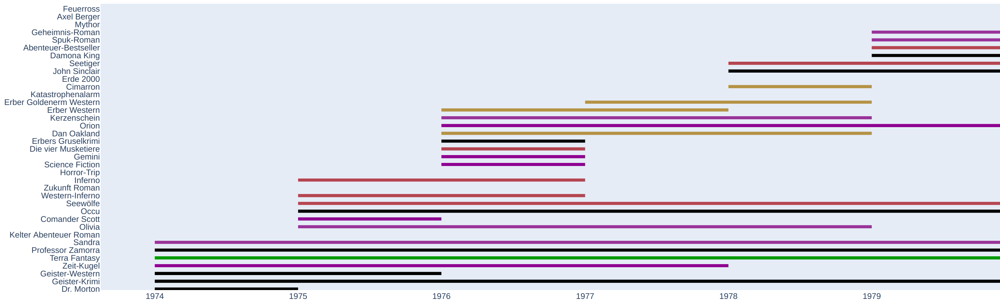
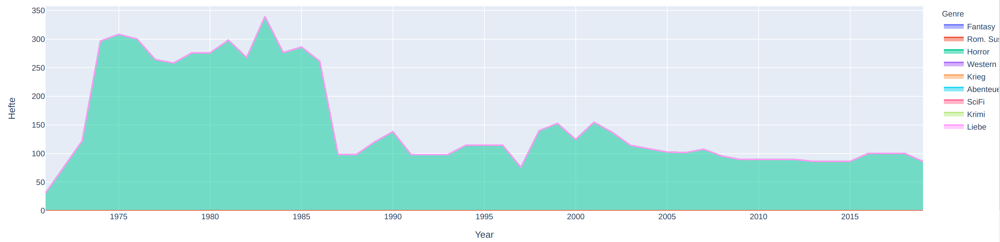

# Heftroman Universum

## Zielsetzung
Ziel der Sammlung ist die Auflistung der in Deutschland erschienen Heftroman Serien und Reihen.
Dabei beschränkt sich der Fokus auf Erstveröffentlichungen. Nachfolgende Auflagen werden nicht
berücksichtigt. Weitergehend sind Taschenbücher, Taschenhefte und Heftmagazine ausgeschlossen. Ausnahme bilden Taschenhefte, falls dort zwei oder mehr Heftromane gebündelt veröffentlicht werden.

## Umgang mit neuen Auflagen und Mehrfachverwertung
Grundsätzlich wird die erste Auflage einer Serie in die Datenbank aufgenommen. Sollte allerdings eine spätere Auflage neue Romane über die erste Auflage hinaus beinhalten, wird auch
diese vermerkt. Auf das platzieren von Romanen aus Serien vor, während oder nach Erscheinen der Serie in Reihen wird keine Rücksicht genommen. In diesem Fall werden Dupletten in den Datensatz aufgenommen.

## Anmerkungen zum Stand der Sammlung

Aktuell ist der Bestand leider noch weit entfernt davon repräsentativ zu sein. Zwar sind einige Genres (Fantasy, Horror, Romantic Suspense) weitestgehend vollständig, dafür fehlen andere komplett (vor allem Liebesromane).
Die Veröffentlichungen pro Jahr sind in der Darstellung gemittelt auf Erscheinungszeitraum und Anzahl Veröffentlichungen insgesamt. Änderungen im Publikationsrhythmus sind noch nicht mit aufgenommen.
Die Sammlung zählt aktuell 73.000 Heftromane aus 660 Serien und Reihen.

## Quellen
Derzeit sind folgende Quellen ausgewertet:
* Wanjek, P.: Bibliographie der deutschen Heftromane 1900-1945.
* romanhefte-info.de
* sf-hefte.de
* groschenhefte.net
* heftromanarchiv-g.jimdofree.com
* goodoldwest.ch
* Bärtle, J.(2018):Grusel, Grüfte, Groschenhefte: Deutsche Grusel-Heftromane von 1968 bis heute – Eine Chronik des "Dämonen-Booms".
* Bärtle, J.(2017):Goblins, Götter, Greifenreiter: Fantasy im deutschen Heftroman von 1972 bis 2012 – über die seltenen Ausflüge in phantastische Welten.
* Bärtle, J.(2019): Geister, Gaslicht, Gänsehaut: Mysteriöse Romanzen, romantische Gothics – Der Spannungsroman für Frauen.
* Bärtle, J.(2015): Götzen, Gold und Globetrotter: Deutschen Abenteuer-Heftromane von 1960 bis 2015 – mit Übersicht der wichtigsten Nachkriegsserien
## Verwendung des Dashboards
### Requirements
Folgende Software muss installiert sein:  
python >= 3.7  
numpy >= 1.17.4  
pandas >= 1.0.0  
dash >= 1.8.0  
dash-table >= 4.6.0  
plotly >= 4.5.0  
### Starten des Dashboards
1. Terminal im Order heftroman-universum öffnen
2. App mit "python start_dashboard.py" starten
3. Im Browser http://127.0.0.1:8050/ aufrufen
### Verwendung des Dashborads
Die im Dashboard angezeigten Visualisierungen sind interaktiv, d.h. es ist
möglich in die Bilder zu zoomen und durch Bewegen der Maus über bestimmte Elemente
der Grafiken zusätzliche Informationen zu erhalten. Zusätzlich kann die
Tabelle am unteren Ende des Dashboards gefiltert werden (z.b. nach Jahren, Genres oder Verlagen).
Die Grafiken darüber werden automatisch an die Selektion angepasst.

Hier wurde bspw. ein Filter verwendet um nur Horror Romane anzuzeigen.
## Rohdaten
Die zugrundliegenden Daten sind plot_hefte_.csv zu entnehmen.

